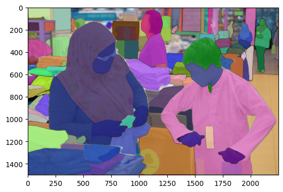

# SA-1B-Downloader

Simple script using GPT-4 to parallelize download and extract files for [SA-1B Dataset](https://ai.facebook.com/datasets/segment-anything/). 
**Copy from [SA-1B-Downloader](https://github.com/KKallidromitis/SA-1B-Downloader)**
## Requirements
* Python >= 3.6
* requests >= 2.0
* pycocotools 

Install with:
```
pip install requests pycocotools
```

## Usage

The download.py script uses the [sa1b_links.txt](https://ai.facebook.com/datasets/segment-anything-downloads/) file by default as the input file for downloading and extracting images:

```
python download.py --processes 4 --input_file sa1b_links.txt --raw_dir raw --images_dir images --masks_dir annotations
```

The download.py script takes the following command-line arguments:

    --processes: The number of processes to use for downloading and extracting files (default: 2)
    --input_file: The path to the input file containing file names and URLs (default: 'sa1b.txt')
    --raw_dir: The directory to store downloaded files (default: 'raw')
    --images_dir: The directory to store extracted jpg files (default: 'images')
    --masks_dir: The directory to store extracted json files (default: 'annotations')
    --skip_existing: Skip extraction if the file has already been extracted (default: False)
    

# SA-1B 

```
dataset = SA1BDataset("path/to/dataset")

# Get the total number of samples in the dataset
print(f"Number of samples: {len(dataset)}")

# Access a specific sample by index
img, mask, class_ids = dataset[0]

# Display the image, mask, and class IDs for the sample
print("Image:", img)
print("Mask:", mask)
print("Class IDs:", class_ids)


data = SA1BDataset('path/to/dataset',ids=['sa_223754'])
img,mask, class_ids = data[0]
ax = plt.subplot()

ax.imshow(img)
for i in range(len(class_ids)):
    show_mask(mask[:,:,i],ax,True)
ax.axis('off')
plt.show()
```

